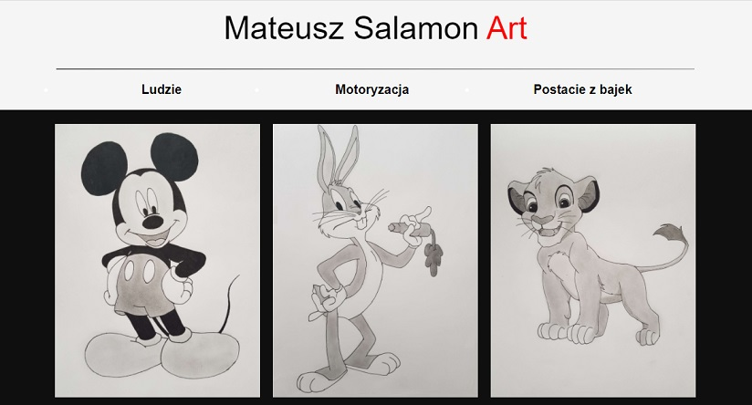

# Gallery

This project is a simple gallery. One of my hobby is drawing so I decided make a website and put some of my pictures which I draw when I was a teenager. 
Creating this site I have learned animations and transitions.

## Technologies
* HTML5
* CSS3 (animations, transitions)
* Javascript

## Setup
To run gallery you should only clone this repository or download .zip file.
